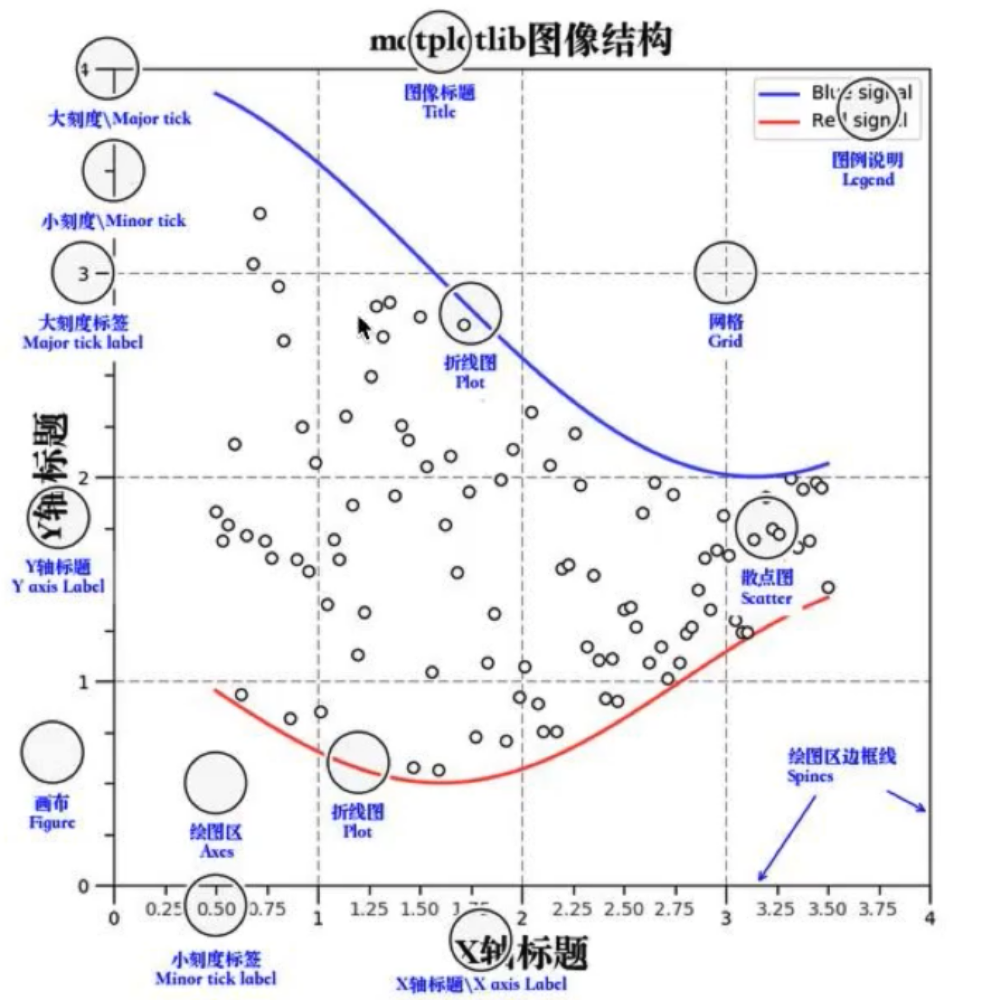
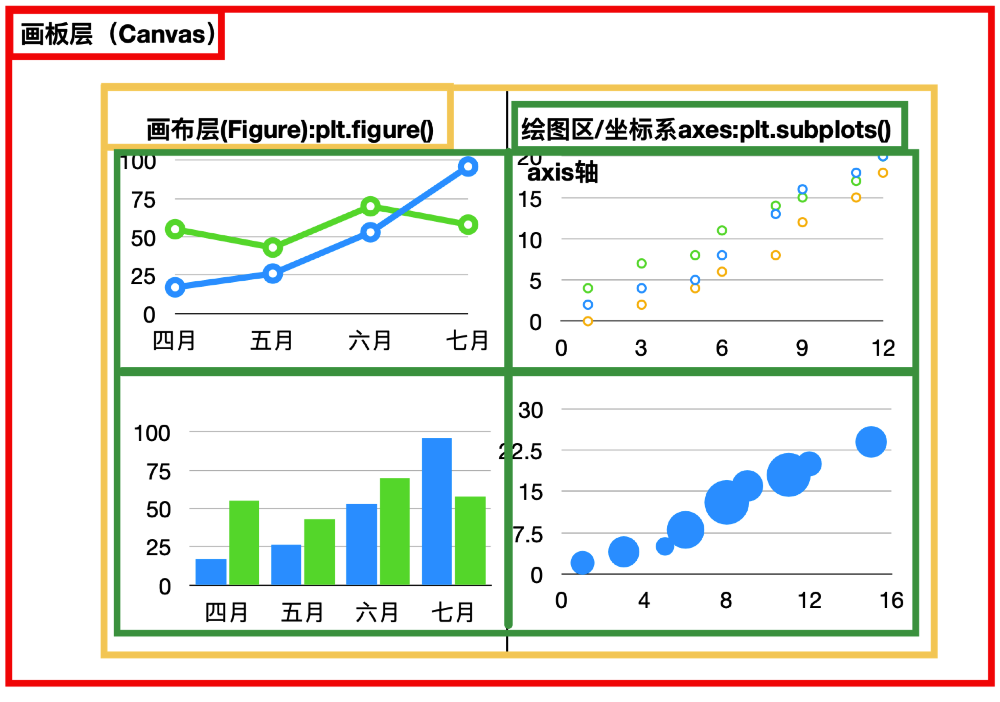
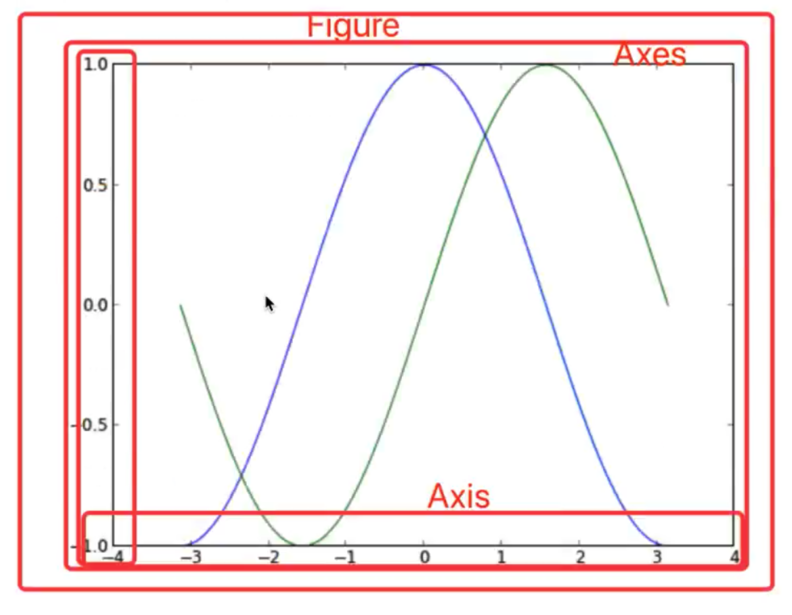

<p align="center">
 
 <h1 align="center">数据挖掘</h1>
 <p align="center"><b>子标题（说明）</b></p>
</p>


<div align=center>


[](LICENSE)


<div align=left>
<!-- 顶部至此截止 -->


[toc]


# 环境安装与介绍

| 库         | 说明                                                |
| ---------- | --------------------------------------------------- |
| matplotlib |                                                     |
| numpy      |                                                     |
| pandas     |                                                     |
| TA-Lib     | 技术指标库                                          |
| tables     | 读取某一种数据文件（hdf5 - 经过压缩的一种数据文件） |
| jupyter    | 数据分析与展示的平台                                |


## Jupyter Notebook

### 简介

**Jupyter Notebook 可以理解为 web 版本的 iPython**

Jupyter项 目是一个非盈利的开源项目，源于2014年的Python项目，并逐渐发为支持跨所有编程语言的交互式数据科学计算的工具。

- JupyterNotebook，原名 ipython Notebook，是 iPython 的加强网页版，一个开源Web应用程序
- 名字源自 Julia、 Python 和 R（数据科学的三种开源语言）
- 是一款程序员和科学工作者的编程/文档/笔记/展示软件
- `ipynb` 文件格式是用于计算型叙述的 **JSON文档格式**的正式规范


**为什么使用 Jupyter Notebook？**

- 画图和展示数据方便


### cell 操作

**cell：一对 In-Out 会话被视作一个代码单元，称为 cell**

Jupyter 支持两种模式：

- 编辑模式（ Enter）
    - 命令模式 下`回车 Enter` 或 `鼠标双击 cell` 进入编辑模式
    - 可以操作 cell 内文本或代码，剪切/复制/粘贴移动等操作
- 命令模式（Esc）
    - 按Esc退出编辑，进入命令模式
    - 可以操作 cell 单元本身进行剪切/复制/粘贴/移动等操作


### 使用 Jupyter Notebook

| 功能                                 | 快捷键                                               |
| ------------------------------------ | ---------------------------------------------------- |
| 打开 Jupyter Notebook                | 终端中输入：`jupyter notebook` 或 `ipython notebook` |
| 运行此单元格的代码，并自动选择下一个 | Shift + Enter                                        |
| 运行此单元格的代码，留在此单元       | Ctrl + Enter                                         |
|                                      |                                                      |


| 命令模式下（ESC 进入） | 操作                        |
| ---------------------- | --------------------------- |
| A                      | 在当前 cell 上面插入新 cell |
| B                      | 在当前 cell 下面插入新 cell |
| 双击D                  | 删除当前 cell               |


| 编辑模式下（Enter 进入）  | 操作       |
| ------------------------- | ---------- |
| Ctrl + / 或 CMD + /       | 添加注释   |
| 按住 Alt 或 Option 点鼠标 | 多光标操作 |
| Tab                       | 补全代码   |


## Matplotlib


### 简介


**名字：**

- mat - matrix
- plot - 画图
- lib - library


**功能：**

- 专门用于开发 2D 或 3D 图表的 Python 库
- 使用起来极其简单
- 以渐进、交互式方式实现数据可视化


**为什么学习 Matplotlib**

将数据可视化，更直观的呈现；在我们进行数据挖掘和分析之前可以帮助我们选择一个更加适合的方法。

言外话：在 JavaScript 中好用的数据可视化工具有 D3 和 百度的 echarts


### 图像结构




### Matplotlib 三层结构


**由底向高：**

- **画板层（Canvas）**

​	Canvas是位于最底层的系统层，在绘图的过程中充当画板的角色，即放置画布（Figure）的工具。


- **画布层（Figure）**

    Figure是 Canvas上方的*第一层*，也是需要用户来操作的应用层的第一层，在绘图的过程中充当画布的角色

    创建或设置画布：`plt.figure()`

    

- **绘图区/坐标系（Axes）**

    Axes是应用层的第二层，在绘图的过程中相当于画布上的绘图区的角色

    画布上是默认有一个绘图区，一个绘图区是有 x、y 轴张成的区域

    手动创建新的话：`plt.subplots()`

    - **图像层**

        每一个绘图区上的不同图像层都可以画不同的图表

        图像层指 Axes 内通过 plot、scatter、bar、histogram、pie 等函数根据数据绘制出的图像

        

    - **辅助显示层**

        图像上的那些坐标、网格、辅助线等。辅助图像的显示

        辅助显示层为 Axes（绘图区）内的除了根据数据绘制出的图像以外的内容，主要包括 Axes外观（facecolor）、边框线（spines）、坐标轴（axis）、坐标轴名称（axis labe）、坐标轴刻度（tick）、坐标轴刻度标签（tick label）、网格线（grid）、图例（legend）、标题（title）等内容

        该层的设置可使图像显示更加直观更加容易被用户理解，但又不会对图像产生实质的影响


**特点：**

- 一个 figure（画布）可以包含多个axes（坐标系/绘图区），但是一个axes只能属于个 figure
- 一个 axes（坐标系/绘图区）可以包含多个axis（坐标轴），包含两个即为2d坐标系，3个即为3d坐标系


**总结：**

- Canvas（画板）位于最底层，用户一般接触不到
    - Figure（画布）建立在 Canvas 之上
        - Axes（绘图区）建立在 Figure之上
            - 坐标轴（axis）、图例（legend）等辅助显示层以及图像层都是建立在 Axes 之上






### 绘图

`matplotlib.pytplot` 包含了一系列类似于 matlab 的画图函数。他的函数作用于当前图形（figure）的当前坐标系（axes）

```python
 import matplotlib.pyplot as plt
```


| 中文   | 英文      |
| ------ | --------- |
| 折线图 | plot      |
| 散点图 | scatter   |
| 柱状图 | bar       |
| 直方图 | histogram |
| 饼图   | pie       |


---


### 折线图（plot）与基础绘图功能

#### API

| API                                         | 功能                           | 参数                                 |
| ------------------------------------------- | ------------------------------ | ------------------------------------ |
| `plt.figure(figsize=(x, y), dpi=y轴分辨率)` | 创建画布                       |                                      |
| `plt.plot(x轴数据列表, y轴数据列表)`        | 绘制图像                       |                                      |
| `plt.xticks(x要显示的刻度列表, **说明)`     | 添加自定义 x 刻度              |                                      |
| `plt.yticks(y要显示的刻度列表, **说明)`     | 添加自定义 y 刻度              |                                      |
| `plt.title('说明字符串')`                   | 添加标题                       |                                      |
| `plt.xlabel('说明字符串')`                  | 添加 x 轴说明                  |                                      |
| `plt.ylabel('说明字符串')`                  | 添加 y 轴说明                  |                                      |
| `plt.grid(True, linestyle='--', alpha=0.5)` | 添加网格显示                   | `linestyle`-线条风格；`alpha`-透明度 |
|                                             |                                |                                      |
|                                             |                                |                                      |
| `plt.savefig('路径')`                       | 保存图像                       |                                      |
| `plt.show()`                                | 显示图像，并释放画布的所有资源 |                                      |


#### 图形风格

| 颜色字符 | 风格字符        |
| -------- | --------------- |
| r 红色   | `-` 实线        |
| g 绿色   | `--` 虚线       |
| b 蓝色   | `-.` 点划线     |
| w 白色   | `:`点虚线       |
| c 青色   | `''` 留空、空格 |
| m 洋红   |                 |
| y 黄色   |                 |
| k 黑色   |                 |


#### 显示图例

​	注意:如果只在plt.plot()中设置label还不能最终显示出图例，还需要通过plt.legend()将图例显示出来。

```python
 # 绘制折线图
plt.plot(x, y_shanghai, label="上海")

# 使用多次plot可以画多个折线
plt.plot(x, y_beijing, color='r', linestyle='--', label="北京")

# 显示图例
plt.legend(loc="best")
```


| **Location String** | **Location Code** |
| ------------------- | ----------------- |
| 'best'              | 0                 |
| 'upper right'       | 1                 |
| 'upper left'        | 2                 |
| 'lower left'        | 3                 |
| 'lower right'       | 4                 |
| 'right'             | 5                 |
| 'center left'       | 6                 |
| 'center right'      | 7                 |
| 'lower center'      | 8                 |
| 'upper center'      | 9                 |
| 'center'            | 10                |


#### 多个坐标系显示 plt.subplots(面向对象的画图方法)


可以通过subplots函数实现(旧的版本中有subplot，使用起来不方便)，推荐subplots函数


**API:**

`matplotlib.pyplot.subplots(nrows=列数, ncols=行数, **fig_kw) ` 创建一个带有多个axes(坐标系/绘图区)的图

返回值：

- figure : 图对象
- axes : 返回相应数量的坐标系

之后在调用的时候，也不能直接使用 `plt.方法名()` 了，要用返回的 `ares[索引].set_方法名()` 

另外，在这种多坐标系显示的情况下，设置标题的方式也有所不同：

技巧：基本是涉及到辅助显示层的都要加 `set_`

- set_xticks 
- set_yticks 
- set_xlabel
- set_ylabel

> 参考：https://matplotlib.org/api/axes_api.html#matplotlib.axes.Axes


#### 应用场景

`plt.plot()` 除了画折线图还可以画各种数学函数图像

```python
# 准备数据
import numpy as np
from matplotlib import pyplot as plt

x = np.linspace(-1, 1 , 1000)
y = 2 * x * x

# 创建画布
plt.figure(figsize=(20, 8), dpi=80)

# 绘制图像
plt.plot(x, y)

# 添加网格显示
plt.grid(linestyle='--', alpha=0.7)

# 显示图像
plt.show()
```


---


### 散点图（scatter）

简单示例：

```python
from matplotlib import pyplot as plt

"""
探究房屋面积和房屋价格的关系
x - 房屋面积
y - 房屋价格
"""
# 准备数据
x = [225.98, 247.07, 253.14, 457.85, 241.58, 301.01, 20.67, 288.64, 163.56, 120.06, 207.83, 342.75, 147.9 , 53.06, 224.72, 29.51,
21.61, 483.21, 245.25, 399.25, 343.35]

y = [196.63, 203.88, 210.75, 372.74, 202.41, 247.61, 24.9 , 239.34, 140.32, 104.15, 176.84, 288.23, 128.79, 49.64, 191.74, 33.1 ,
30.74, 400.02, 205.35, 330.64, 283.45]

# 新建画布
plt.figure(figsize=(20, 8), dpi=100)

# 绘制散点图
plt.scatter(x, y)

# 展示图像
plt.show()
```


### 柱状图（bar）

```python
from matplotlib import pyplot as plt

# 对比每部电影的票房收入
 
# 准备数据
x_moives = ['雷神3:诸神黄昏','正义联盟','东方快车谋杀案','寻梦环游记','全球风暴', '降魔传','追捕','七十七天','密战','狂兽','其它']
y_tickes = [73853,57767,22354,15969,14839,8725,8716,8318,7916,6764,52222]

# 创建画布
plt.figure(figsize=(20, 8), dpi=80)

# 绘制柱状图
x = range(len(x_moives))
plt.bar(x, y_tickes, width=0.5, color=['b','r','g','y','c','m','y','k','c','g','b'])

# 辅助显示层
plt.title('2017年票房对比')
plt.xticks(x, x_moives)
plt.grid(linestyle='--', alpha=0.5)

# 显示
plt.show()
```


#### 平移坐标以显示多个柱子


- **如果要想实现在一个分类里显示两个柱状图，本质上是在绘制时把柱子和坐标平移！**


```python
from matplotlib import pyplot as plt


# 准备数据
movie_name = ['雷神3:诸神黄昏','正义联盟', '寻梦环游记']
first_day = [105786.3, 10063.5, 1278.3]
first_weekend = [36224.9, 34486.6, 11863]

# 创建画布
plt.figure(figsize=(20, 8), dpi=80)

# 绘制柱状图
"""
【重点】要想在一个分类里显示两个，其实是把第二个柱状图给平移了一下，避免两个柱状图挡在一起
 这里用一个列表生成式进行书写
""" 
x = range(len(movie_name))
plt.bar(x, first_day, width=0.2, label='首日票房')
plt.bar([i + 0.2 for i in x], first_weekend, width=0.2, label='首周票房')
plt.legend()  # 显示图例

# 辅助显示层
plt.title('第一天及第一周票房')
plt.xticks([i + 0.1 for i in x], movie_name)  # 【重点】修改刻度，这里的列表生成式其实是把刻度给平移了

# 展示
plt.show()
```


### 直方图（histogram）

直方图（histogram）用于反映数据的分布状况


### 饼图（pie）


